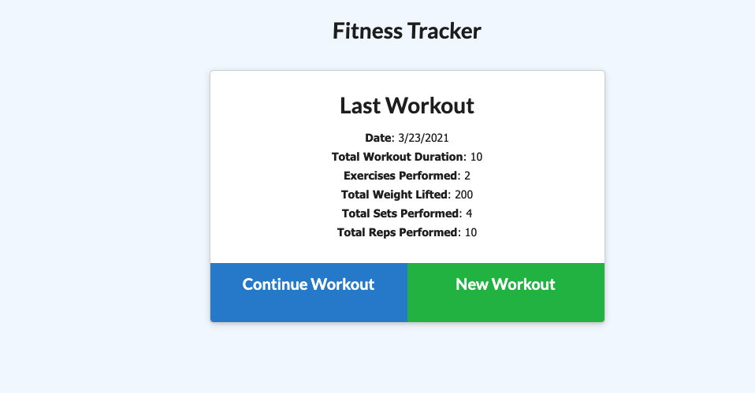
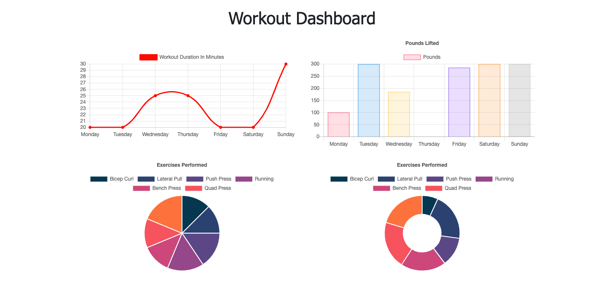

# Workout-Tracker


### Description
>The purpose of this application is to track all exercises that the user inputs. The user has the ability to add new exercises or continue their workout. 
### Technologies Used

>- Morgan
>- Mongo Database
>- Express
>- Mongoose
>- Node.js
>- robo 3T

## Deployed Link
>[Heroku](https://pacific-fjord-25851.herokuapp.com/?id=605a4796d15e3f0015ba19f9)

## REPOLINK  
>[Fitness-Tracker](https://github.com/elhiloyasin/workout-tracker)


## SCREENSHOT OF APPLICATION





## Contact Information

```
Feel free to contact me
```
 >
  Email | elhiloyasin@gmail.com|
  ------------------------------ 
  github | https://github.com/elhiloyasin
  ------------------------------ 


